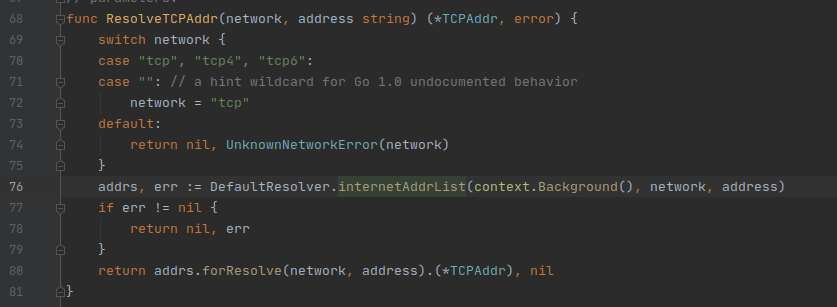

## net.ResolveTCPAddr



参数是 network，address。选择哪种网络，输入地址，返回值是对应的 TCPAddr 的 struct

```go
// TCPAddr represents the address of a TCP end point.
type TCPAddr struct {
	IP   IP
	Port int
	Zone string // IPv6 scoped addressing zone
}
```

使用方法是：

```go
tcpAddr := net.ResolveTCP("tcp"，*tcpAddress)
```

